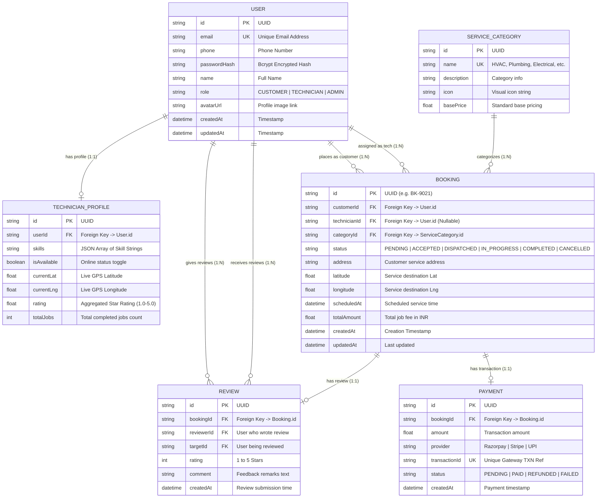

# FieldFix — Entity-Relationship (ER) Diagram

This document contains the complete database entity design for the **FieldFix** platform, matching the Prisma schema ([`schema.prisma`](file:///c:/Users/USER/Desktop/SE_lab/FieldFix/backend/prisma/schema.prisma)).

## 📊 Visual Mermaid ER Diagram

---

## 🗄️ Relational Integrity & Key Constraints

1. **User Table (`users`)**:
   - `email` is enforced UNIQUE.
   - Roles are string-validated (`CUSTOMER`, `TECHNICIAN`, `ADMIN`).
2. **Technician Profile (`technician_profiles`)**:
   - `userId` has `onDelete: Cascade` to automatically remove profile on user deletion.
3. **Booking Table (`bookings`)**:
   - `customerId` links to the requesting Customer User.
   - `technicianId` is nullable (assigned during auto-dispatch or manual admin allocation).
4. **Payment Table (`payments`)**:
   - 1-to-1 relationship with `Booking`.
   - `transactionId` enforced UNIQUE to prevent double charges.
5. **Review Table (`reviews`)**:
   - 1-to-1 relationship with `Booking` with ratings from 1 to 5.
