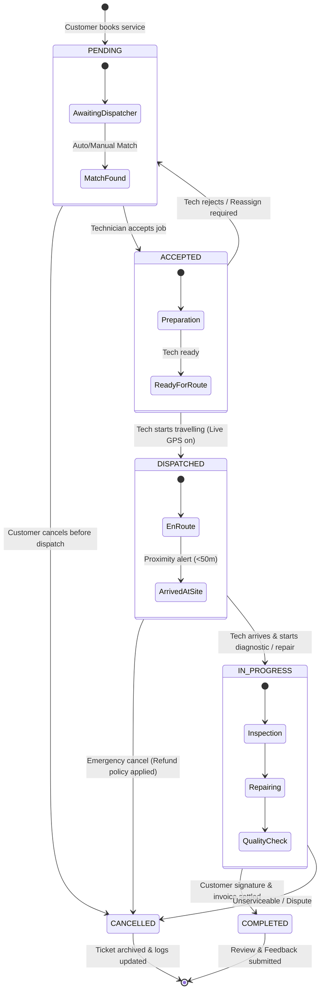

# FieldFix — Service Booking State Transition Diagram

This document models the lifecycle of a FieldFix service ticket from creation to completion or cancellation.

---

## 🔄 State Transition Diagram (Mermaid)

---

## 📋 State Descriptions & Triggers

| State | Trigger | Actor | Actions & Events |
| :--- | :--- | :--- | :--- |
| **`PENDING`** | Customer submits booking on Web/Mobile | Customer | Payment pre-auth, broadcast job alert to eligible technicians in radius. |
| **`ACCEPTED`** | Technician clicks "Accept Job" | Technician | Job locked to technician, SMS/push notification sent to customer. |
| **`DISPATCHED`** | Technician taps "Start Trip" | Technician | Socket.IO live GPS stream begins; customer radar view updates with live ETA. |
| **`IN_PROGRESS`** | Technician arrives and starts work | Technician | Timer starts; parts and repair checklist activated. |
| **`COMPLETED`** | Technician finishes repair + OTP/Signature | Both | Payment captured, digital invoice generated, rating modal displayed. |
| **`CANCELLED`** | Booking aborted by customer or admin | Customer / Admin | Refund triggered, technician status set back to available. |

graph LR
    subgraph Frontend ["Frontend (Vite + React + TS)"]
        UI["Admin Web & Customer Portal (Port 5180)"]
    end

    subgraph Backend ["Backend Engine (Node.js + Express + TS)"]
        API["REST API (Port 5000)"]
        WS["Socket.IO Gateway (Port 5000)"]
    end

    subgraph Database ["Database Layer"]
        PRISMA["Prisma ORM"]
        DB[(PostgreSQL / SQLite)]
    end

    UI -->|"HTTP Requests (Axios / React Query)"| API
    UI <-->|"Bi-directional Live GPS Streams"| WS
    API --> PRISMA
    PRISMA --> DB
Frontend: React 18, TypeScript, Tailwind CSS, Vite, Lucide Icons, Socket.IO Client.
Backend: Node.js, Express, TypeScript, Socket.IO Server, JWT Auth, Bcrypt.
Database: Prisma ORM talking to PostgreSQL / SQLite.
How they Join:
Data Queries & Auth: Frontend uses Axios in 

admin-dashboard/src/services/api.ts
 to call REST endpoints on http://localhost:5000/api.
Real-time Live Location: Frontend connects via WebSockets in 

admin-dashboard/src/services/socket.ts
 to receive instant GPS pings and dispatch status changes without page refreshing.
📂 3. Where the Database & Auth Files Are Located
🗄️ Database Files
Schema Definition: 

backend/prisma/schema.prisma
Contains models: User, TechnicianProfile, ServiceCategory, Booking, Payment, Review.
Seed Data Script: 

backend/prisma/seed.ts
Populates mock users, categories, and technicians.
🔐 Auth & Login/Register Files
Frontend Login Page: 

admin-dashboard/src/pages/LoginPage.tsx
Frontend Register Page: 

admin-dashboard/src/pages/RegisterPage.tsx
Frontend Auth Service: 

admin-dashboard/src/services/auth.ts
Backend Auth Route: 

backend/src/routes/auth.ts
📑 SRS Deliverables & Diagrams
ER Diagram: 

docs/ER_DIAGRAM.md
State Transition Diagram: 

docs/STATE_TRANSITION.md
🌿 4. Git Branch & How Neerav Should Pull
We are currently working on branch: 👉 shrutika/admin-login-page

Step 1: Save and Push Shrutika's work
Run these commands in your terminal:

bash
git add .
git commit -m "feat(shrutika): complete database setup, admin UI, routing, subpages, and SRS diagrams"
git push origin shrutika/admin-login-page
Step 2: How Neerav can pull your work
Tell your friend Neerav to run:

bash
git fetch origin
git checkout -b shrutika-work origin/shrutika/admin-login-page
# Or if merging into main via GitHub Pull Request:
# Create PR: shrutika/admin-login-page -> main, merge it, then Neerav runs:
# git checkout main && git pull origin main
