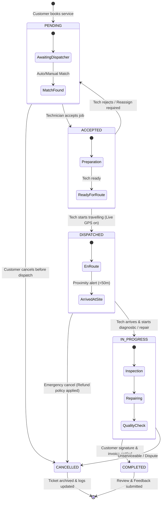

# FieldFix — Service Booking State Transition Diagram

This document models the lifecycle of a FieldFix service ticket from creation to completion or cancellation.

---

## 🔄 State Transition Diagram (Mermaid)

---

## 📋 State Descriptions & Triggers

| State | Trigger | Actor | Actions & Events |
| :--- | :--- | :--- | :--- |
| **`PENDING`** | Customer submits booking on Web/Mobile | Customer | Payment pre-auth, broadcast job alert to eligible technicians in radius. |
| **`ACCEPTED`** | Technician clicks "Accept Job" | Technician | Job locked to technician, SMS/push notification sent to customer. |
| **`DISPATCHED`** | Technician taps "Start Trip" | Technician | Socket.IO live GPS stream begins; customer radar view updates with live ETA. |
| **`IN_PROGRESS`** | Technician arrives and starts work | Technician | Timer starts; parts and repair checklist activated. |
| **`COMPLETED`** | Technician finishes repair + OTP/Signature | Both | Payment captured, digital invoice generated, rating modal displayed. |
| **`CANCELLED`** | Booking aborted by customer or admin | Customer / Admin | Refund triggered, technician status set back to available. |
